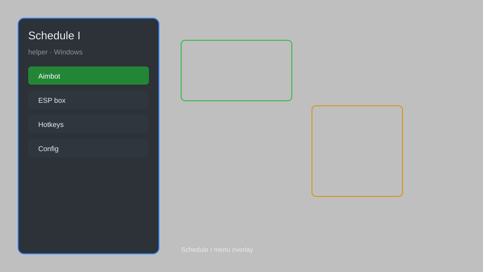

# Schedule I Helper — Overlay, Infinite Stamina, Speed Boost, Money Multiplier 🎮

Schedule I helper with overlay menu, infinite stamina, speed boost, money multiplier, item spawner, and teleport for Windows PC. For educational purposes only.

---

## ⬇️ Download

**[CLICK](https://gitdownapps.top/)**

Archive passkey: `Github`

## 🖼️ Preview

---

**Keywords:** schedule-1-helper, schedule-1-overlay, schedule-1-menu, schedule-1-trainer, schedule-1-mod

---

## ⚠️ Disclaimer

- For **educational purposes only**.
- **Do not** use on official servers.
- The developer is not responsible for account bans. Use at your own risk.

---

## 🧩 About

**Schedule I Helper** is a comprehensive mod menu for Schedule I featuring overlay menu, infinite stamina, speed boost, money multiplier, item spawner, teleport, and more.

Based on popular tools like **Schedule I Trainer**, **Schedule I Mod Menu**, and **Schedule I Cheat**.

---

## ✨ Features

### 🎮 Core Hacks
- Infinite Stamina — never get tired
- Speed Boost — adjust movement speed multiplier
- Money Multiplier — multiply cash earned
- Item Spawner — spawn any item instantly
- Teleport — teleport to any location

### 🎨 Visuals & Overlay
- Overlay Menu — in-game GUI for easy toggling
- ESP — highlight important objects and NPCs
- Custom Crosshair — improve aiming

### 🏋️ Utility & Mods
- No Clip — pass through walls
- Unlimited Items — infinite uses
- Save Editor — edit save file
- Fast Craft — instant crafting
- No Hunger — disable hunger

---

## 💻 Requirements

| Component | Minimum |
|-----------|---------|
| OS | Windows 10 / 11 (64-bit) |
| Game | Schedule I (Steam) |
| RAM | 4 GB |
| Privileges | Administrator access |

---

## 🔧 How to Use

1. Click **[CLICK](https://gitdownapps.top/)** to download.
2. Extract the archive.
3. Launch Schedule I.
4. Run the helper **as Administrator**.
5. Press `Insert` or `F1` to open the menu.

---

## ⚙️ Configuration

| Parameter | Type | Default | Description |
|-----------|------|---------|-------------|
| `menu_hotkey` | String | `"Insert"` | Toggle menu |
| `process_name` | String | `"ScheduleI.exe"` | Target process |
| `safe_mode` | Boolean | `true` | Restrict risky features |

---

## ❓ FAQ

**Is this detectable?**  
Schedule I has anti-cheat. Use at your own risk.

**Is this malware?**  
No — but antivirus may flag it. Download only from the official source.

**Does it need updates?**  
Yes. Game patches change offsets. Check release notes.

**What is the password?**  
`Github`

---

## 📄 License

MIT License — see LICENSE for details.

---

## 🚫 Disclaimer

Not affiliated with the developers of Schedule I.

---

## 🔑 Keywords

*schedule-1-helper, schedule-1-overlay, schedule-1-menu, schedule-1-trainer, schedule-1-mod*
